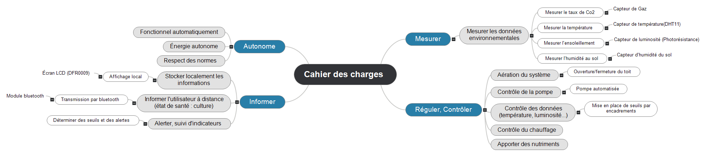
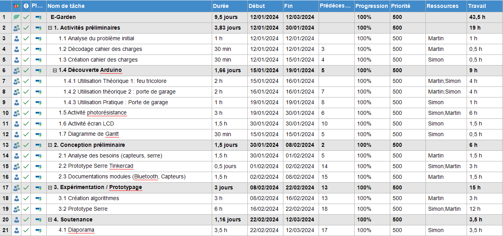
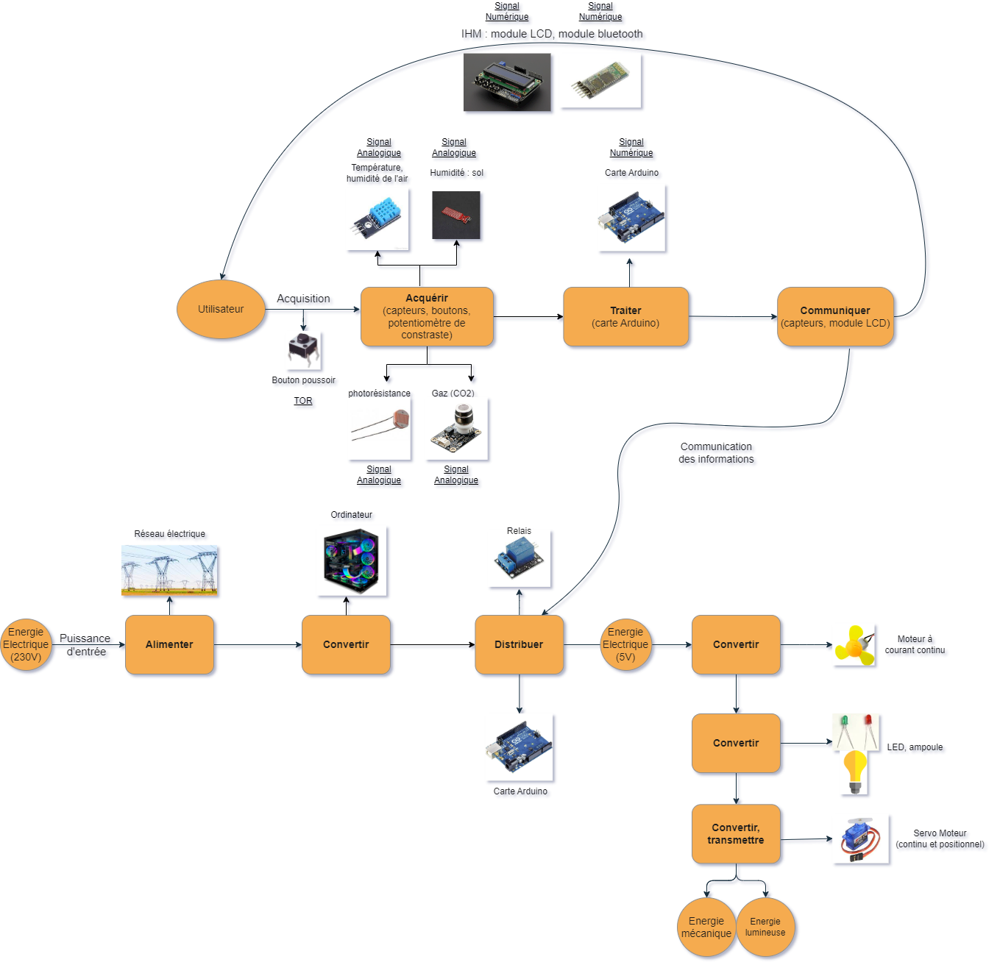
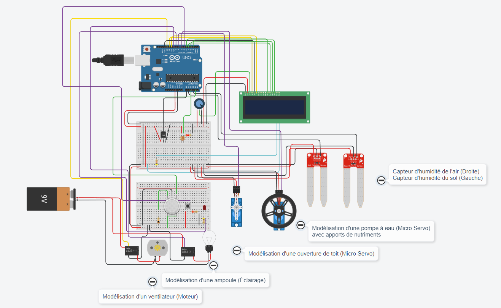
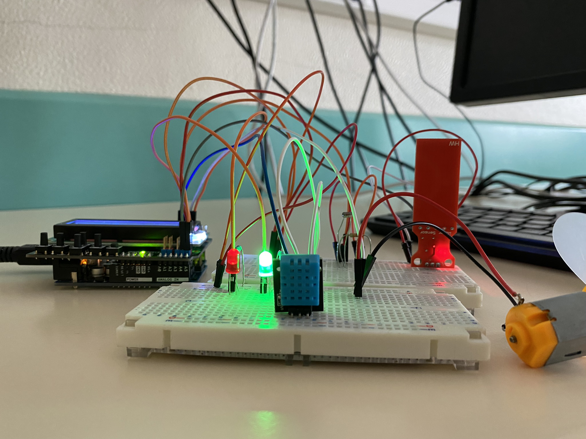

# Projet E-Garden - 1ère STI2D

Réalisation d'un prototype de Jardin Connecté (Jardin Assit) pour permettre de mesurer des données environnementales (Température, Humidité, Gaz, Ensoleillement) grâce à des capteurs et pouvoir agir en conséquences (Températures et humidités trop élevées & Ensoleillement trop bas...).

Ce projet a été réalisé dans notre cursus pour le Baccalauréat STI2D, durant l'année de Première.

**Éxigences :**



**Détails des tâches :**



**Chaine de puissance & d'information :**



## Indispensables pour réalisations

Pour mettre en oeuvre ce projet, vous avez besoin d'une carte Arduino UNO (Carte utilisé pour le projet), des capteurs associés (DHT11 ou DHT22, Photorésistance, FC-28), un module de transmission (HC05) et pour combler tout ça, une petite application AppInventor (Controle à distance). Aussi, l'affichage local se fera via un Ecran LCD 16\*2.

- [Arduino IDE](https://www.arduino.cc/en/software)
- [Libraries](https://github.com/SimSim236/E-Garden/tree/main/librairies)

**Simulation sur TinkerCad :**



## Système final



## Outils importants

- [Tinkercad : Simulations](https://www.tinkercad.com/)
- [Arduino Doc, FAQ](https://www.arduino.cc/)
- [AppInventor : Application mobile](https://appinventor.mit.edu/)

## Installation

1. Clonez le dépôt :
   ```bash
   git clone https://github.com/SimSim236/E-Garden.git
   ```
2. Ouvrez le fichier `E-Garden.ino` avec l'IDE Arduino.
3. Installez les [Libraries](https://github.com/SimSim236/E-Garden/tree/main/librairies) nécessaires.
4. Connectez votre carte Arduino à votre ordinateur.
5. Compilez et téléversez le code sur votre carte.

## License

[MIT](https://choosealicense.com/licenses/mit/)

## Authors

- [🔆 - Sim](https://www.github.com/SimSim236)
- [🎗️ - Lutr4nn](https://www.github.com/Lutr4nn)
